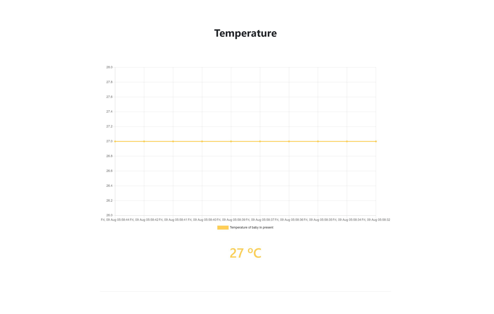
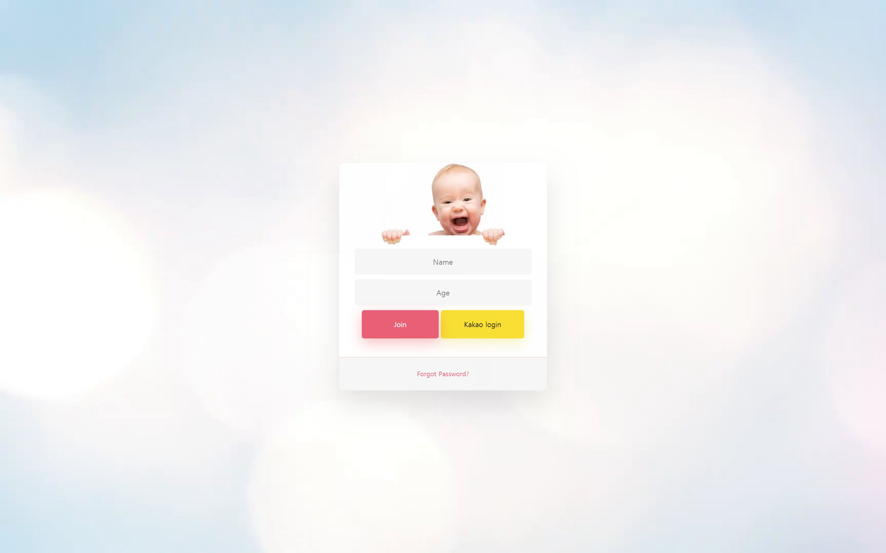
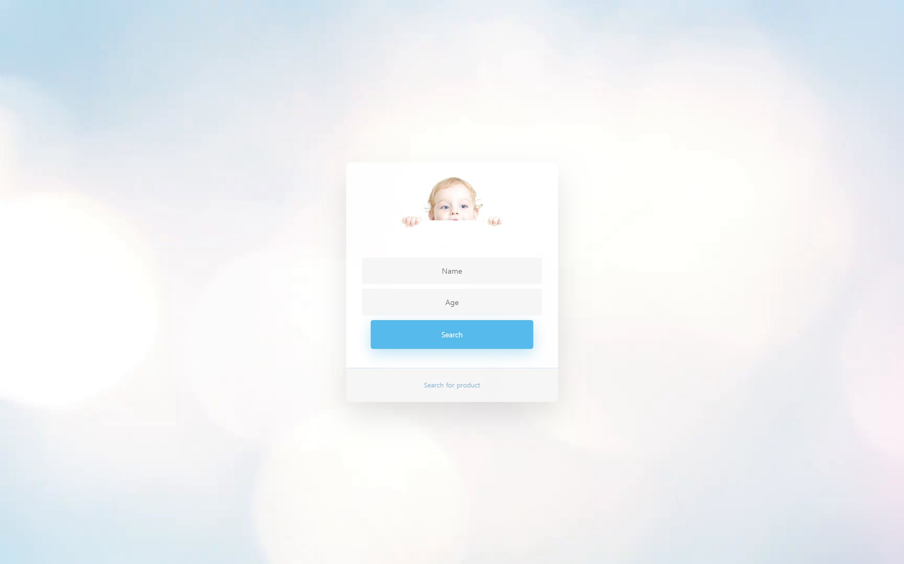

# Babycare
Project for Baby care system

## Structure
### pages
1. index.html
	- layout_index.html 상속
2. join.html
	- layout_join.html 상속
3. search.html
	- layout_search.html 상속
CSS, JS는 layout_*.html에서 작성.

### APIs
1. main.py
2. page_routes.py
	- page 렌더링
2. sensorDataAPI.py
	- DB select, insert, delete, update
	
### etc
common_head.html에서 필요한 외부 JS, CSS Library 추가.

## Arduino Sensor
- [x] 심장박동(WAT-S019, GROVE-Finger-clip Heart Rate Sensor with shell)
- [x] 온/습도(DHT-11)
- [x] 사운드(LM393)
- [ ] 자이로(MPU6050 or STM32 Kalman)

## Web
[http://ec2-3-19-73-118.us-east-2.compute.amazonaws.com:5000](http://ec2-3-19-73-118.us-east-2.compute.amazonaws.com:5000)

