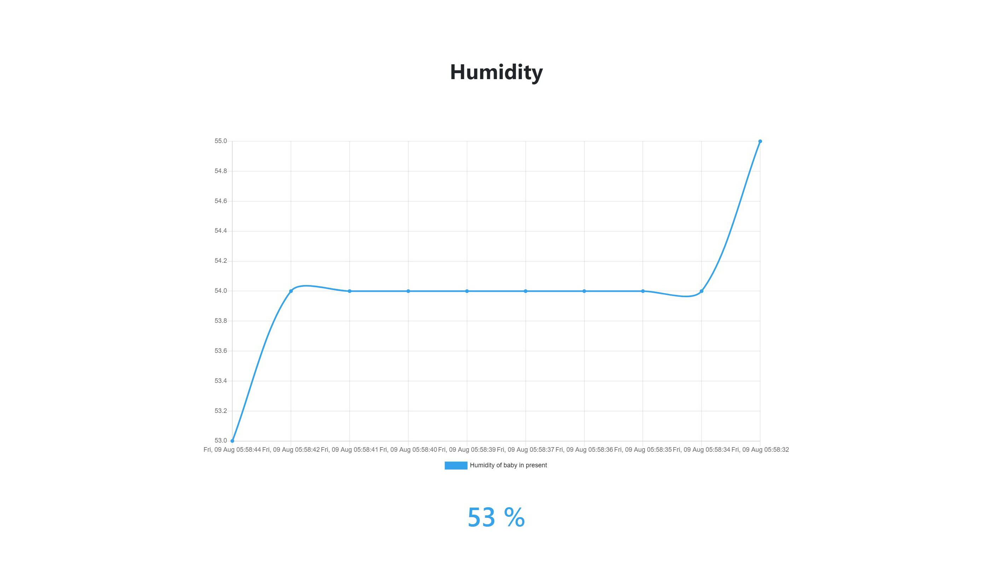

# babycare
project for baby care system  
  
  
## structure
### pages
1. index.html
	- layout_index.html 상속
2. join.html
	- layout_join.html 상속
3. search.html
	- layout_search.html 상속
css, js는 layout_*.html에서 작성.

### apis
1. main.py
2. page_routes.py
	- page 렌더링
2. sensorDataAPI.py
	- db select, insert, delete, update
	
### etc
common_head.html에서 필요한 외부 js, css library 추가.

## arduino sensor
- [x] 심장박동(wat-S019, grove-finger-clip heart rate sensor with shell)
- [x] 온/습도(dht-11)
- [x] 사운드(lm393)
- [ ] 자이로(mpu6050 or stm32 kalman)

## web
[http://ec2-3-19-73-118.us-east-2.compute.amazonaws.com:5000](http://ec2-3-19-73-118.us-east-2.compute.amazonaws.com:5000)

